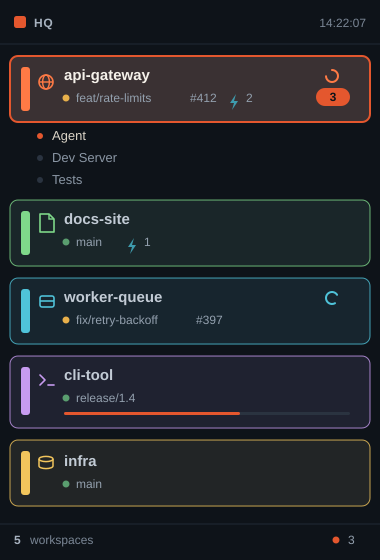
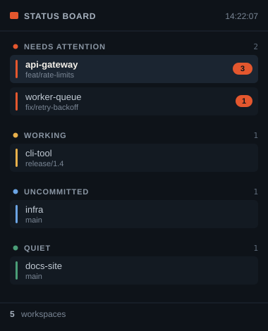
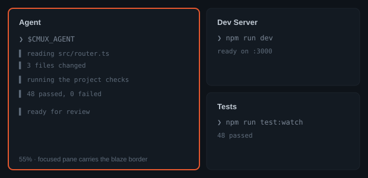

# cmux setup

A sidebar, color scheme, workspace layouts, Dock controls, and a name normalizer
for [cmux](https://cmux.com).

macOS only, because cmux is. Built and tested against cmux 0.64.22 (stable).
Nothing assumes a particular directory layout, and every project gets its own
color without configuration.

Clone it wherever you keep repos, then:

```sh
./install.sh
```

Right-click the sidebar toggle button and choose **hq**.



*Illustrations throughout are drawn from the setup's own color and layout values.*

It deliberately ships no font and no theme. Those live in Ghostty config and
stay your choice.

---

## What you get

**A custom sidebar (`hq`):** replaces cmux's workspace list with one that shows,
per workspace: a color rail and project icon, git branch with a clean/dirty dot,
PR number colored by status, listening-port count, unread badge, a progress bar
when an agent reports one, and a spinner while an agent is working. The selected
workspace expands to show its tabs; click one to focus it. Drag rows to reorder,
which persists. Right-click for pin, mark read, color, and move.

**A second sidebar (`status-board`):** the same workspaces grouped into lanes:
Needs Attention, Working, Uncommitted, Quiet.



**A color scheme:** cool ink base, single blaze accent, matching pane borders and
sidebar tint. Light and dark.

**Behavior fixes:** workspaces hold their position instead of jumping on every
notification. New workspaces append to the end. Plain `Cmd+N` opens a workspace
with an agent already running.

**Dock controls:** git status, listening ports, and htop in the right sidebar.

**A name normalizer:** strips agent status glyphs (`✳`, `◐`) from workspace and
tab titles and Title-Cases them.

---

## Requirements

Only one hard requirement: **cmux**. Everything else degrades.

| | Needed for | If missing |
|---|---|---|
| **cmux** | all of it | nothing works |
| **python3** | `normalize-names.py`, `add-layout.sh`, `scan-projects.sh`, `doctor.sh` | those scripts don't run. The sidebar, colors, Dock and layouts are unaffected. Ships with Xcode Command Line Tools: `xcode-select --install` |
| **an agent CLI** (yours, via `$CMUX_AGENT`) | the workspace layouts | layouts open a plain login shell instead of erroring |
| **git** | Dock Git control, sidebar branch/PR info | those stay empty |
| **htop** | Dock System control | falls back to macOS's built-in `top` |

No plugins, no fonts to install, no theme packages. The sidebars use SF Symbols,
which ship with macOS.

Run `./bin/doctor.sh` to see which of the optional ones you have.

---

## Customizing

### Colors and icons

Automatic. Each repository gets a stable color derived from its directory name,
so two repos never collide by accident and there is nothing to set up.

To override a specific one, edit the block at the top of
`~/.config/cmux/sidebars/hq.swift`:

```swift
func colorOverride(_ dir: String) -> String {
    if dir.contains("my-repo") { return "#FF7A45" }
    return ""
}

func iconOverride(_ dir: String) -> String {
    if dir.contains("my-repo") { return "hammer.fill" }
    return ""
}
```

Any [SF Symbol](https://developer.apple.com/sf-symbols/) name works. Save the file and it hot-reloads. No restart, no reload command.

To generate that block for every repo you have:

```sh
./bin/scan-projects.sh                  # finds your repos automatically
./bin/scan-projects.sh ~/code ~/work    # or point it at specific roots
./bin/scan-projects.sh --dry-run ~/code # print, don't write
```

It picks icons from what's in each repo: `go.mod` gets a box, a Phaser project
gets a game controller, a docs site gets a book.

You can also set a color per workspace from the sidebar's right-click menu.
That wins over everything above; **Clear Color** drops back to the automatic one.

### Workspace layouts

`Cmd+Shift+P` opens the Command Palette. Two layouts ship with this setup:

- **New Agent** — one full pane running your agent, in the current directory
- **Agent + Shell** — agent left, plain shell right

To build one for a specific repo, with its real dev and test commands:

```sh
./bin/add-layout.sh ~/path/to/repo
./bin/add-layout.sh --dry-run ~/path/to/repo
```

It reads `package.json` (npm/pnpm/bun/yarn), `go.mod`, or `Cargo.toml`, detects a
nested frontend directory such as `web/`, then writes an entry that opens an agent
beside the dev server and test watcher.



### Which agent

Set `CMUX_AGENT` in your shell profile to whatever agent CLI you run:

```sh
export CMUX_AGENT=your-agent-cli
```

Every agent pane reads it at launch. Leave it unset and those panes open a login
shell instead. Same result if the command is set but not on PATH.

### Names

```sh
~/.config/cmux/normalize-names.py            # dry run
~/.config/cmux/normalize-names.py --apply    # rename
~/.config/cmux/normalize-names.py --reset    # unpin, let agents drive titles again
```

Renaming a tab pins it, so it stops tracking what the agent is doing. `--reset`
undoes that.

---

## Checking and removing

```sh
./bin/doctor.sh        # validate config, sidebars, and layout paths
./install.sh --dry-run # show what an install would do
./install.sh --uninstall
```

`install.sh` backs up anything it replaces to a timestamped `.bak` next to the
original. `--uninstall` restores the newest backup of each file.

---

## Gotchas

**Optional fields in a custom sidebar need `if let`, not `!= nil`.** The sidebar
interpreter's nil comparison evaluates false even when the value is present, so
`w.color != nil ? w.color : fallback` silently always takes the fallback. Use
`if let c = w.color { ... } else { ... }`. This applies to `color`, `branch`,
`pr`, `progress`, and `latestAt`.

**The `actions` registry is nightly-only.** On stable builds, workspace layouts
must live in `commands` (which is what this setup uses). They appear in the
Command Palette rather than the plus-button menu. `bin/doctor.sh` warns if it
sees an `actions` block on a stable build.

---

## Layout

```
config/cmux.json              settings, colors, shortcuts, base layouts
config/dock.json              right-sidebar controls
sidebars/hq.swift             the main sidebar
sidebars/status-board.swift   lane-grouped alternative
bin/scan-projects.sh          generate per-repo colors and icons
bin/add-layout.sh             generate a workspace layout for one repo
bin/normalize-names.py        clean up workspace and tab names
bin/doctor.sh                 validate an install
install.sh                    install, dry-run, uninstall
README.md                     this file
docs/*.svg                    the illustrations above
```
